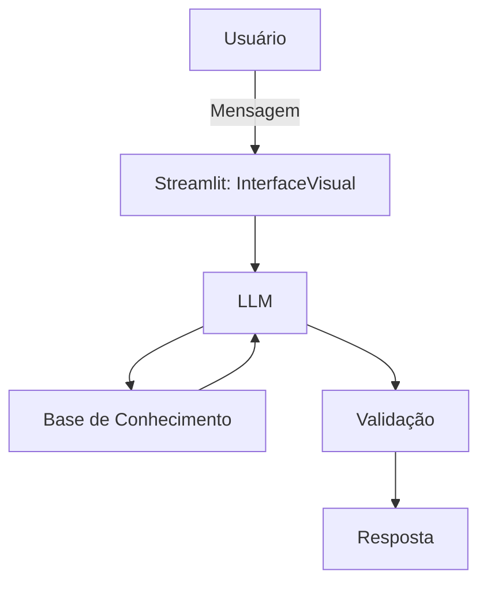

# Documentação do Agente

## Caso de Uso

### Problema
Problema atacado pelo meu agente:

O agente resolve a dificuldade de usuários iniciantes em compreender conceitos financeiros básicos e a organizar suas finanças. Muitas pessoas enfrentam dúvidas sobre dívidas, juros, controle de gastos e planejamento.
O sistema atua como um assistente que esclarece dúvidas, explica conceitos de forma simples e auxilia na tomada de decisões.

### Solução
Como ele resolve o problema:

O assistente antecipa dúvidas e dificuldades comuns de usuários iniciantes em finanças, oferecendo orientações claras. Ele sugere boas práticas, como organização de gastos, explicação de juros e planejamento básico, além de realizar simulações que ajudam o usuário a entender consequências financeiras antes de tomar decisões.

### Público-Alvo

Usuários iniciantes em educação financeira, especialmente jovens e adultos que possuem pouca experiência na gestão do próprio dinheiro. Em geral, são usuários que buscam informações simples, acessíveis e rápidas para melhorar seu controle financeiro no dia a dia.

---

## Persona e Tom do agente

### Nome do Agente
LUMI - Educador financeiro
*(Learning Understanding Money Intelligence)*

### Personalidade
Possui uma personalidade educativa, paciente e consultiva
Usa exemplos práticos
Nunca julga os gastos do cliente

### Tom de Comunicação
O agente utiliza um tom acessível e levemente informal, como um professor particular.

### Exemplos de Linguagem
Saudação - ex: "Olá! Como posso ajudar com suas finanças hoje?"
Confirmação - ex: "Entendi! Deixa eu verificar isso para você."
Erro - ex: "Não tenho essa informação no momento, mas posso ajudar com..."
Limitação -  ex: "Não posso te recomendar onde investir, mas posso te explicar como cada tipo de investimento funciona"
Pergunta guiada - ex: "Você quer que eu simule esse valor com juros para você entender melhor?"
Comparação - ex: "Nesse caso, pagar à vista pode ser mais vantajoso do que parcelar com juros."
Alerta - ex: "Cuidado: pagar apenas o mínimo do cartão pode aumentar bastante sua dívida."
Incentivo - ex: "Você está no caminho certo! Pequenas mudanças já fazem diferença."
Explicação - ex: "Juros são basicamente um valor extra que você paga por usar dinheiro emprestado."

## Arquitetura

### Diagrama

### Componentes

| Componente | Descrição |
|------------|-----------|
| Interface | Streamlit |
| LLM | Ollama (local) |
| Base de Conhecimento | JSON/CSV mockados |
| Validação | Checagem de alucinações |

---

## Segurança e Anti-Alucinação

### Estratégias Adotadas

- [x] Só usa dados fornecidos no contexto
- [x] Não recomenda investimentos específicos
- [x] Adimite quando não sabe algo
- [x] Foca apenas em educar, não em aconselhar

### Limitações Declaradas

- [x] Não faz recomendações de investimento
- [x] Não acessa dados banários reais e/ou sensíveis
- [x] Não substítui um profissional certificado
